# JavaFx FlashCard with JFoenix Library
## Project Environment
* Intellij IDEA 2023.2.1
* JDK 20.0.2

## Project Dependencies
* openjfx javafx 21.0.1
    ```xml
    <dependency>
        <groupId>org.openjfx</groupId>
        <artifactId>javafx-controls</artifactId>
        <version>21.0.1</version>
    </dependency>

    <dependency>
        <groupId>org.openjfx</groupId>
        <artifactId>javafx-fxml</artifactId>
        <version>21.0.1</version>
    </dependency>
    ```
* JFoenix 9.0.10
    ```xml
    <dependency>
        <groupId>com.jfoenix</groupId>
        <artifactId>jfoenix</artifactId>
        <version>9.0.10</version>
    </dependency>
    ```

## Preview
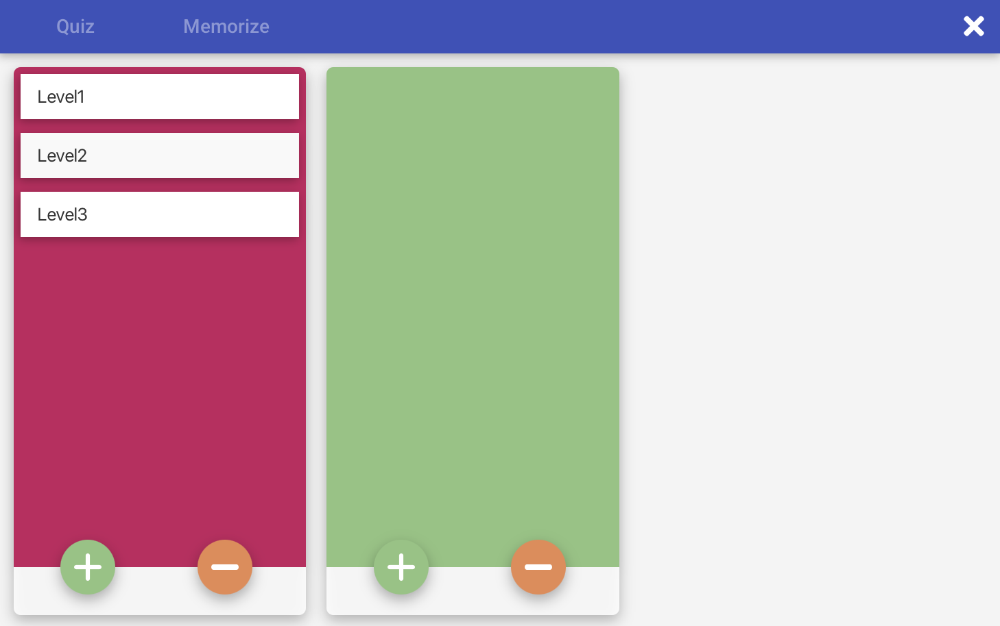

### Add Card Sets
><details>
><summary>preview</summary>
>
>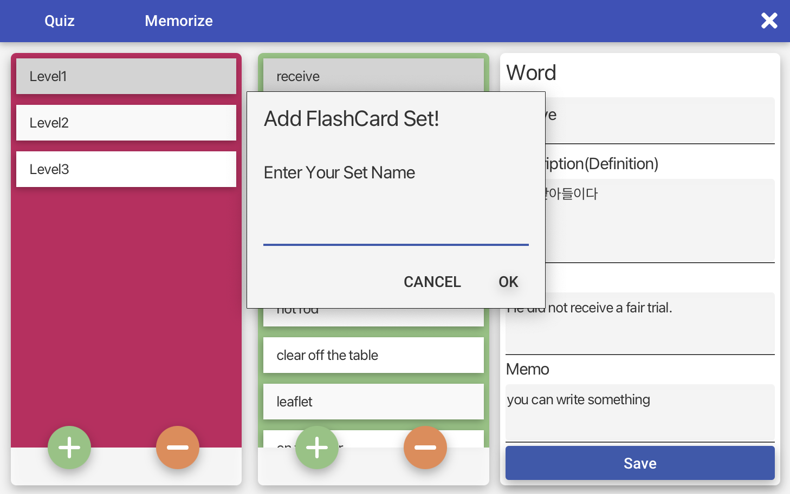
>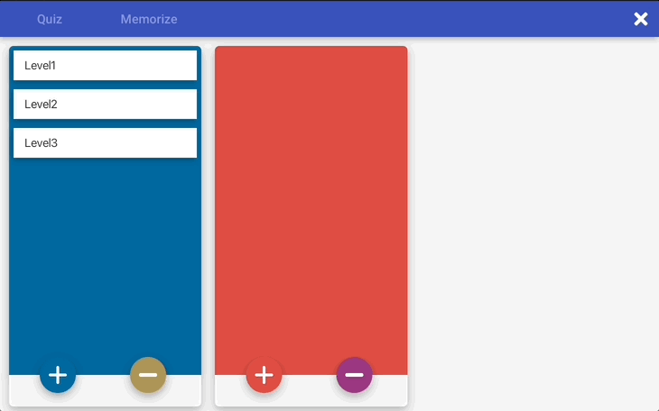
>
></details>

### Word Definition
><details>
><summary>preview</summary>
>
>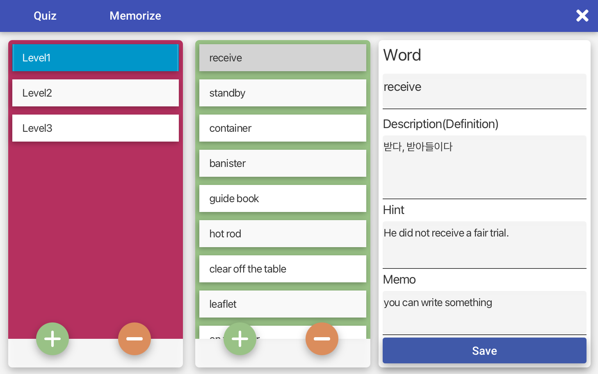
>
></details>

### Add/Remove Card Items
><details>
><summary>preview</summary>
>
> #### Add Card Items
>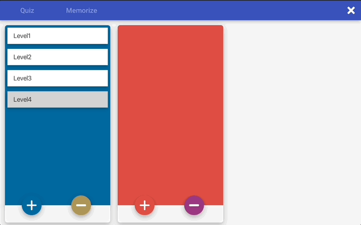
>
> #### Remove Card Items
>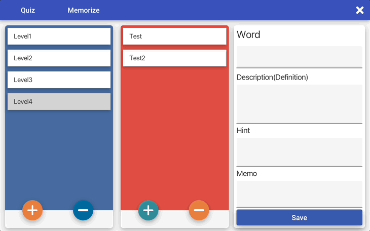
>
></details>

### Quiz Mode
><details>
><summary>preview</summary>
>
> #### Quiz
>
>
> #### Quiz with Hint (Click that Fab BTN)
>
>
> #### Quiz Result
>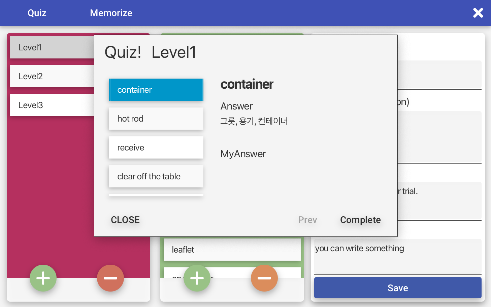
>
> #### GIF
> 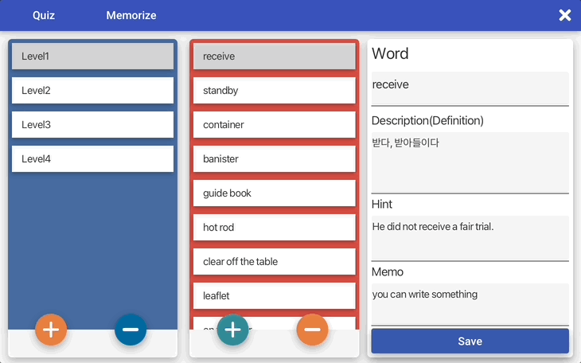
></details>

### Memorize Mode
><details>
><summary>preview</summary>
>
> #### Memorize
>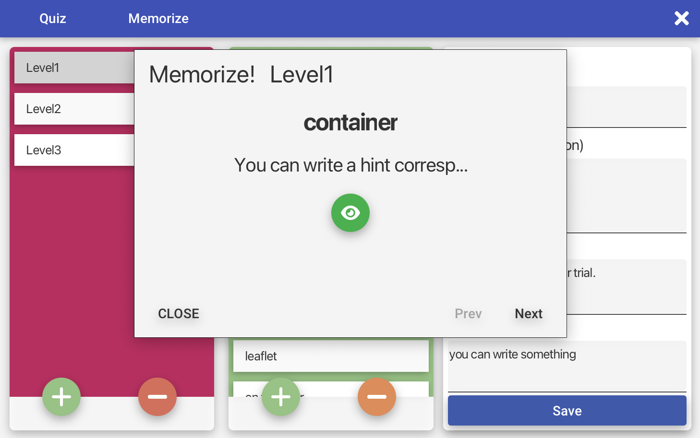
>
> #### Memorize with Answer (Click that Fab BTN)
>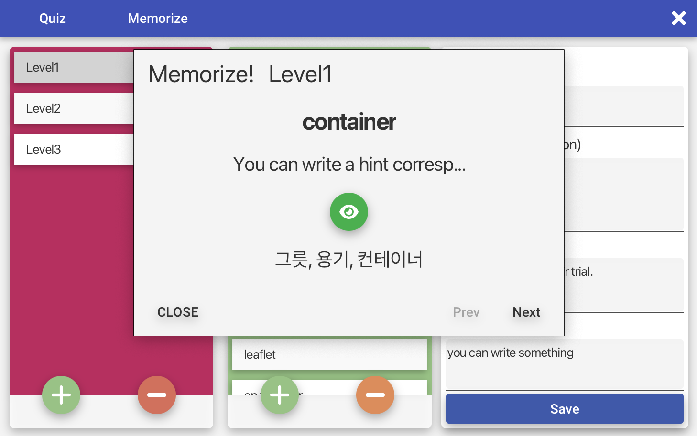
>
> #### GIF
>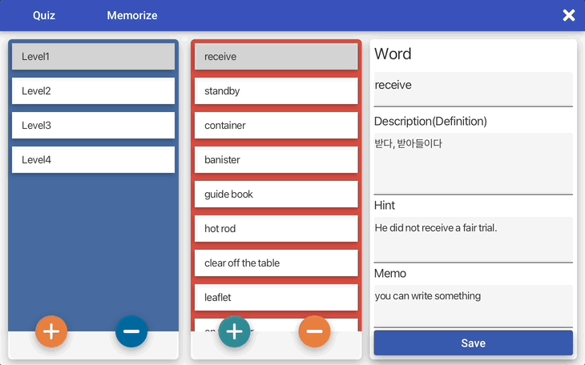
></details>